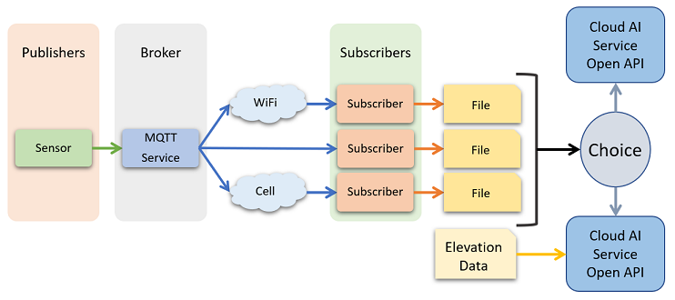

# Environmental Robot Boat sp20-516-233 Holly Zhang

## Abstract

We introduce a network architecture using the MQTT protocol to send sensor data 
from an environmental robot boat to various cloud AI services. 

## Evaluating Messaging Protocols

### MQ Telemetry Transport

This messaging protocol was specifically made for devices with low capacities 
and requires low energy to execute [@rabbit]. Since a large amount of energy is 
consumed from the the boat's battery by the motors, we want the program to use 
as little energy as possible. Furthermore, the emphasis on low end devices 
means that executing the code on a Raspberry Pi 3B+ should be possible with this 
protocol. 

### Simple Text Oriented Message Protocol

STOMP is a protocol that utilizes text-based messaging and emphasizes ease of 
use [@rabbit]. STOMP does not use topics and queues, but instead uses 
destination strings and a SEND semantic [@cloud-stomp]. With more complicated 
interactions between clients and the broker, it may be difficult in keeping 
track of messages with just destination strings. Since clients can use almost 
any STOMP broker, it is possibly that a broker could become flooded with 
messages from clients.   

### Advanced Message Queuing Protocol

This will most likely not be used in the project since the Python library for 
AMQP does not support Python 3.8 [@amqp]. Furthermore, it is mostly used in 
industrial settings and puts importance in reliability and security 
[@cloud-amqp]. While these are good features to have, these may slow down 
devices that have low computing capacity such as simple sensors. 

## Evaluating Messaging Toolkits

### MQTT Toolkits

#### Paho MQTT Python

The Paho Python client ...[@eclipse-paho]. Although  

#### Mosquitto Python Client

The Mosquitto Python library is now depreciated so it will not be used. Instead, 
it has been added into the Eclipse Paho project [@eclipse-mosquitto].

### STOMP Toolkits

#### Apache ActiveMQ

Apache's ActiveMQ supports 

### Other Toolkits

#### RabbitMQ

RabbitMQ supports multiple messaging protocols such as MQTT, STOMP, and a few 
versions of AMQP. However, it has AMQP 0-9-1 as its main messaging protocol, 
while other messaging protocols must be downloaded as plugins from the website 
[@rabbit]. The appropriate plugins can be found through the following link:

<https://www.rabbitmq.com/protocols.html>  

## Network Architecture

The network architecture of the environmental robotic boat is shown in the 
following diagram. In this scenario, the MQTT protocol is used to send sensor 
data to other devices. In the MQTT protocol, clients of the MQTT service do not 
interact with each other. Instead, they interact with a third party called the 
broker which runs the MQTT service. When clients send information 
to the broker, this is called publishing. Hence, these clients are called 
publishers. Similarly, clients that request for information from the broker are 
called subscribers because this action is called subscribing. 

{#fig:Network 
architecture of the environmental robot boat}

>* Broker: Raspberry Pi 
>* Publishers: Sensors
>* Subscribers: Computing Devices

In this case, the broker will be a Raspberry Pi running MQTT services locally 
while mounted onto the boat. The publishers in this architecture are the sensors 
on the boat since they will be sending data to the Raspberry Pi. The subscribers 
will be the devices that subscribe to the Raspberry Pi's MQTT service. These 
subscribers could be laptops, phones, other Raspberry Pis, etc. As such, the 
diagram shows that the broker can send the data to the subscribers through 
different means such as WiFi and cellular.

After receiving the data, the subscribers will want to store it as persistent 
data so that it can be referred to later. This means that the subscribers should 
write the data into files the moment it is received. Later on, the stored data 
can be sent to a cloud AI service of choice along with data gathered previously 
from the robotic boat.

## MQTT Setup

In order to use the MQTT protocol, the proper preparations need to be made.

### Installing the Paho MQTT Library

Since the network architecture involves the MQTT protocol, it can be expected 
that it is required for development. The MQTT protocol is available in the Paho 
MQTT python library. Use the following command to download Paho MQTT:

```bash
$ pip install paho-mqtt
``` 

### Install the Mosquitto Broker

The robotic boat will need the the Raspberry Pi to run the MQTT service locally. 
This means that an MQTT broker has to be installed so the Raspberry Pi can offer 
the MQTT service. The Mosquitto Broker was chosen for installation, but other 
brokers can be used as well. Use the following command to install the Mosquitto 
Broker:

```bash
$ sudo apt-get install mosquitto
```

### Enable Websocket in the Mosquitto Broker

Later on it will be useful to have MQTT service on a web browser. Websockets 
allow this possibility by wrapping around the MQTT protocol and then having a 
TCP packet envelop it. The TCP packet containing the MQTT protocol and websocket 
can then be sent through the internet and display on a browser. 

#### Install Websocket Dependencies
Although Websockets are supported by Mosquitto, it is not enabled by default. 
The following commands will download the needed libraries for websockets:

```bash
$ sudo apt-get update
$ sudo apt-get install build-essential python quilt python-setuptools python3
$ sudo apt-get install libssl-dev
$ sudo apt-get install cmake
$ sudo apt-get install libc-ares-dev
$ sudo apt-get install uuid-dev
$ sudo apt-get install daemon
$ sudo apt-get install libwebsockets-dev
``` 

#### Download Mosquitto 

Though the Mosquitto broker has already been downloaded, this download is for 
obtaining the `config.mk` file which is not available in the previous download. 
Before downloading, first check the version of Moquitto that was downloaded 
previously.

```bash
$ mosquitto --version
```

If the displayed version is Mosquitto 1.6.9, then the following commands can be 
followed directly. However, if the version is different, some of the commands 
will need to be changed to accommodate the other version. The following commands 
were modified from 
<https://gist.github.com/smoofit/dafa493aec8d41ea057370dbfde3f3fc>:

```bash
$ wget http://mosquitto.org/files/source/mosquitto-1.6.9.tar.gz
$ tar zxvf mosquitto-1.6.9.tar.gz
$ cd mosquitto-1.6.9/
$ sudo vim config.mk
```

Inside the `config.mk` file, search for the line `WITH_WEBSOCKETS:=no`. Change 
the line so that it now displays `WITH_WEBSOCKETS:=yes`. Save the changes and 
then build Mosquitto with the new configuration using the following commands:

```bash
$ make
$ sudo make install
$ sudo cp mosquitto.conf /etc/mosquitto
```

The last command copied the new `mosquitto.conf` and put it in the 
`/etc/mosquitto` which is where the Mosquitto Broker was downloaded. This means 
that the Mosquitto Broker now has a configuration file that allows websockets. 
However, websockets have not been enabled yet. To enable websockets, navigate 
to the directory of the Mosquitto Broker:

```bash
$ cd /etc/mosquitto
$ sudo vim mosquitto.conf
```

Once the `mosquitto.conf` file is open, search for the section called `Default 
Listener`. Under that section, add the following lines:

```
port 1883
listener 9001
protocol websockets
```

When using MQTT with websockets, the preferred port is 9001. The port for 
regular MQTT is defaulted to 1883.

### Finding the Localhost IP Address

On Linux, use the following command in terminal:

```bash
$ hostname -I
``` 
 
On Windows, use the following command on Command Prompt:

```bash
$ ipconfig
```

### Client

The first line of code creates a MQTT client. The second line connects the 
client to the public server named `mqtt.eclipse.org` on port 1883. 

```
client = mqtt.Client()

client.connect("mqtt.eclipse.org", 1883, 60)
```

This creates a MQTT client that runs on a local server on port 1883. The 
`client_id` specifies a name for the client. If `client_id` is left empty, then 
it will be automatically assigned a random name. We set `clean_session=False` 
because we want the broker to keep information about the subscriptions and 
queued messages whenever the client disconnects. We need to specify the MQQT 
`protocol` version since the automatic default can change with updates.  

```
client = mqtt.Client("mqttClient", clean_session=False, protocol=mqtt.MQTTv31)

---------- other code for client setup in between -------------

client.connect(host="insert_localhost_ip_address", port=1883)
```

#### Subscriber

Here we have assign the subscriber message as `OpenAgBloom/#` with a quality of 
service `qos` of 1. We choose `qos=1` because we want to be sure that the 
messages are sent to the broker. However, it is possible that there are 
duplicate messages so additional code will be needed to prevent this. Another 
possibility is using `qos=2` which ensures that   

```
client.subscribe("subscriber_message", 1)
```

#### Publisher

```
client = mqtt.Client()
client.connect(broker_ip, broker_port)
```

#### Logging

To create a log, define a Python function called `on_log` that contains all the 
necessary logging information. Then set `client.on_log = on_log` to start 
logging the information. 

```
def on_log():
    # include logging code
client.on_log = on_log
```

