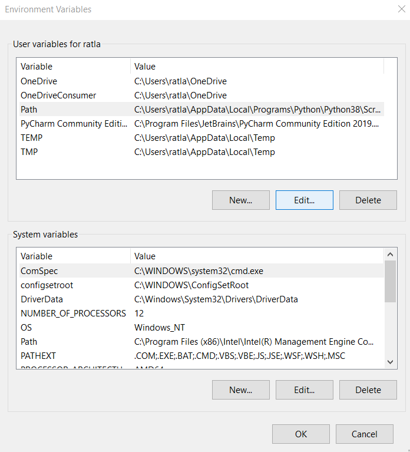

# MongoDB Install Windows Holly Zhang sp20-516-233

## MongoDB Community Edition Information (Windows):

Information about the community edition for Windows can be found in the 
following link: 

<https://docs.mongodb.com/manual/tutorial/install-mongodb-on-windows/>


## Prerequisites for Windows Versions Before Windows 10

If you have a version of Windows before Windows 10, you must update 
`Universal C Runtime`. The update instructions can be found at the following 
link: 

<https://support.microsoft.com/en-us/help/2999226/update-for-universal-c-runtime-in-windows>

*If you have Windows 10, you do not need this update.*

## Downloading the Installer

*You may need to create an account before being allowed to download the 
installer.*

The installer download can be found at the following link: 

<https://www.mongodb.com/download-center/community?jmp=docs>

You will need to choose `Windows x64` as the `OS`. Make sure that the correct 
version of MongoDB has been selected. By default, it should have the current 
version already selected. Once the `OS` has been selected, it will automatically 
select the `MSI` package needed for the specified `OS`. The following image 
shows how this should look like before pressing the `Download` button.

{#fig:mongoDB-installer-package}

## Installer Setup

Once the installer has finished downloading, execute the installer.

{#fig:mongoDB-install-wizard}

During the setup process, make sure to **Deselect** 
`Install MongoD as a Service`. 

{#fig:mongo-config}

## Adding MongoDB in the Path

In Windows, search for `Environment Variables`.

{#fig:environment-variables-search}

Then press the `Environment Variables` button in the `System Properties` window.

{#fig:environment-variables}

Once the `Environment Variables` window is open, under 
`User variables for username`, select the line 
containing`Path`. Then press the `Edit` button to edit your path.

{#fig:environment-variables-edit}

We now want to find where MongoDB was installed on the machine. Press the 
`Browse` button to search for the MongoDB executable location. In this example, 
the MongoDB executable was located at `C:\Program Files\MongoDB\Server\4.2\bin`. 
However, this location may vary depending on where MongoDB was installed on the 
machine.

{#fig:environment-variables-path}

## Checking MongoDB in Command Prompt

Make sure that MongoDB was installed successfully on your machine by entering 
the following command in Command Prompt: 

```bash
$where mongod
```

Depending on where MongoDB is installed, the command should return an output 
similar to this:

```bash
C:\Program Files\MongoDB\Server\4.2\bin\mongod.exe
```

      